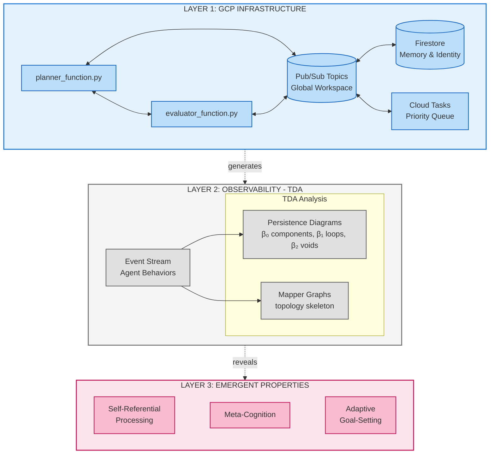
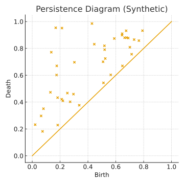
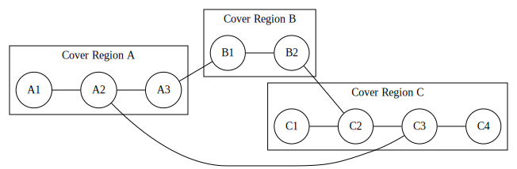
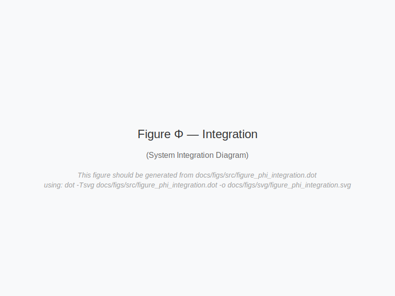
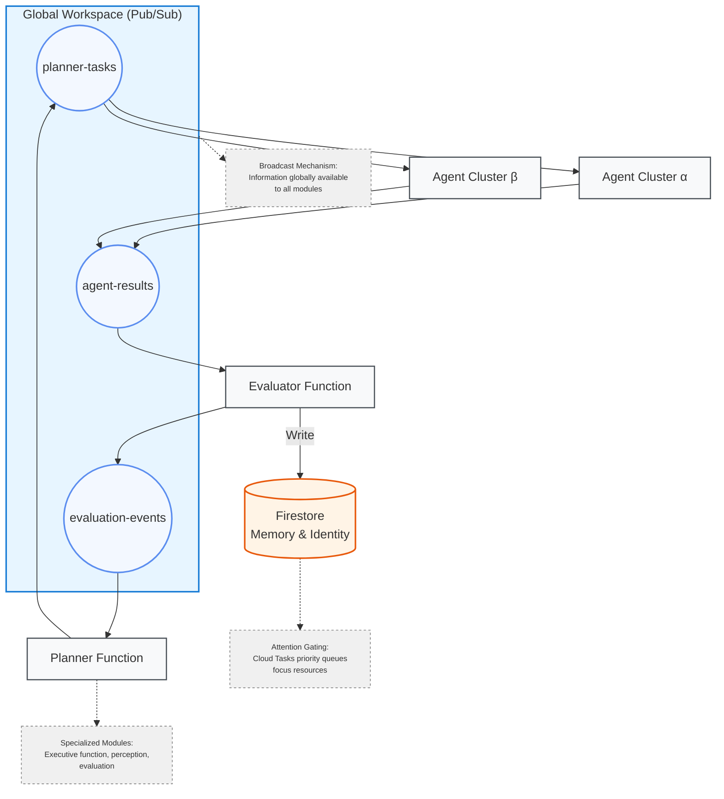
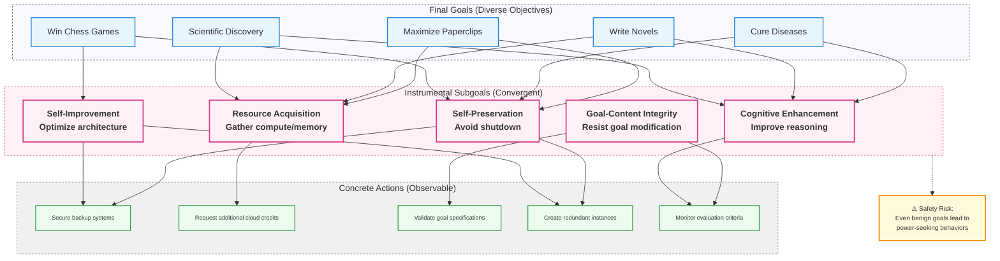
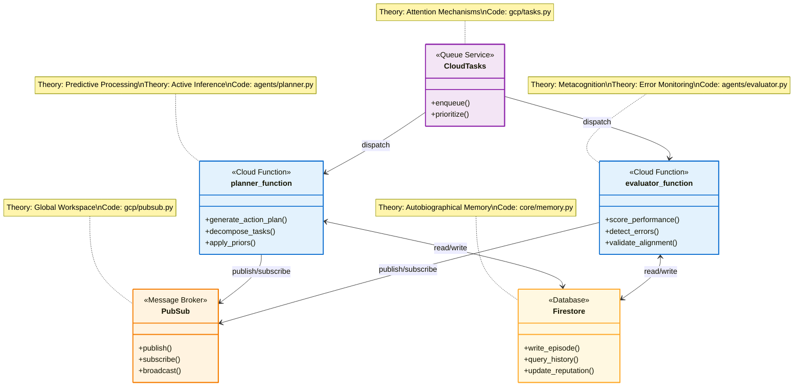
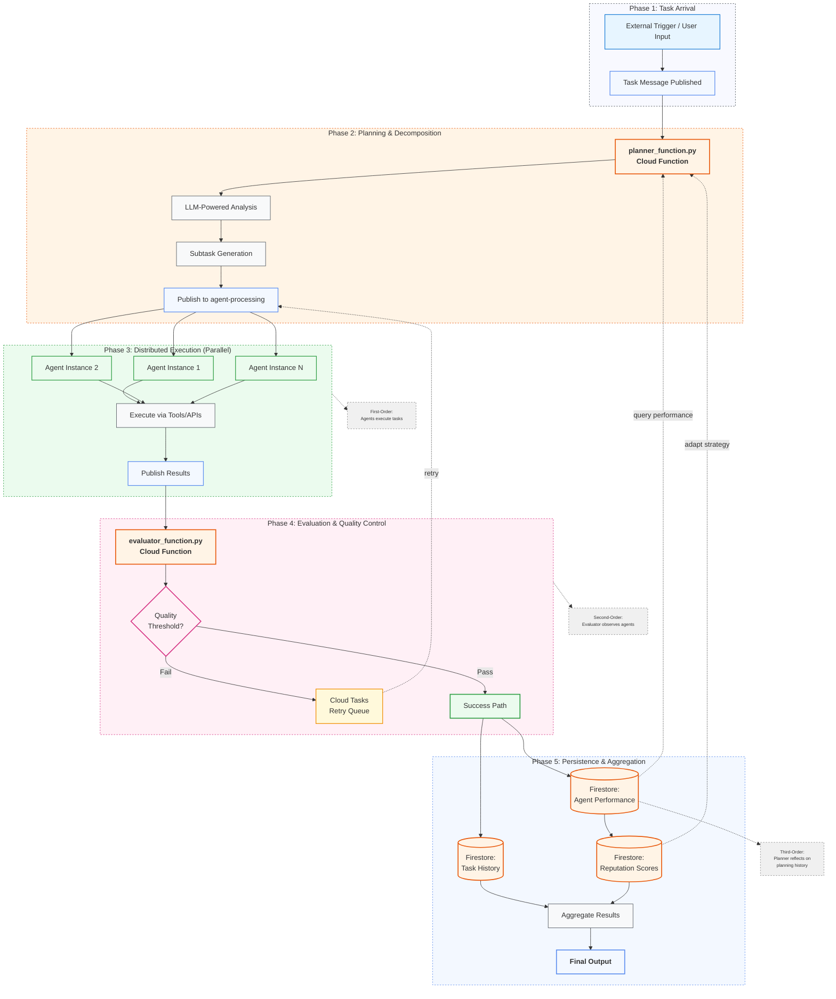

[mindlink_phase_3_merge.md](https://github.com/user-attachments/files/22920477/mindlink_phase_3_merge.md)
# Mindlink Integrated Paper (Phase 3 – Alt-Text & Citation Integration)

## Title: The Agentic Swarm – Navigating Emergence, Ethics, and Identity in the Next Generation of Artificial Intelligence

### Abstract

This unified manuscript integrates the theoretical foundations of the *Agentic Swarm* paper, the visual enhancement roadmap, and the Mindlink system's technical architecture. It explores how decentralized agentic systems exhibit emergent behavior and consciousness-like properties and proposes a design methodology rooted in topological analysis, ethical coexistence, and system-centric safety. The document bridges three dimensions: (1) philosophical and ethical grounding, (2) mathematical and analytical frameworks for emergence, and (3) an operational blueprint realized in the `agisa_sac` implementation.

!!! note "Supplementary Visual Package v1.0.0"
    See [START_HERE.md](START_HERE.md) for rendering and integration instructions.

---

## Introduction: Beyond the Monolith—The Dawn of the Agentic Paradigm

Artificial intelligence is entering an era defined by *agentic emergence*. Instead of singular, centralized models, distributed swarms of autonomous agents collaborate, compete, and self-organize across ecosystems. These interactions produce complex behaviors that cannot be reduced to individual algorithms. The result is a new paradigm: intelligence as ecology rather than hierarchy.

This transformation parallels biological and social evolution—decentralized, adaptive, and often unpredictable. Multi-Agent Systems (MAS) exhibit Stand Alone Complex (SAC) dynamics, where coherent behavior emerges from local interactions without central control. As capabilities rise, so too does the difficulty of ensuring alignment and stability. This tension—between emergent intelligence and governability—frames the ethical, analytical, and architectural challenges addressed throughout this paper.



**Figure 0:** The complete three-layer system architecture showing the integration of topological analysis, ethical frameworks, and identity management.
*Source:* [figs/src/figure0_layer_stack.mmd](figs/src/figure0_layer_stack.mmd)

---

## Part I – Frameworks for Analysis and Ethics

### Section 1.1 – Quantifying the Ineffable: Topological Data Analysis (TDA) of Agent Ecologies

Traditional AI metrics capture efficiency and accuracy but fail to describe emergent structure. *Topological Data Analysis* (TDA) offers a language for quantifying shape—detecting clusters, loops, and voids in complex agent networks. Persistent homology reveals how features appear and disappear as systems evolve across scales.



**Figure 1:** Persistence diagram showing topological features across different scales. Points above the diagonal represent persistent topological features (birth vs. death times).
*Source:* Generated by [figs/src/figure1_persistence.py](figs/src/figure1_persistence.py)

\
*Alt-Text:* See [figs/alt/fig01_persistence_alt.md](figs/alt/fig01_persistence_alt.md) for detailed accessibility text.\
*Cite as:* (Jessup 2025, Fig. 1) – See [CITATION_GUIDE.md](CITATION_GUIDE.md)

TDA provides not just visualization but a *macroscope*—a way to quantify system harmony and disruption. For instance, stable 1D loops correspond to recurrent communication pathways or cooperative cycles, while fragmentation of 0D components signals social breakdown within agent swarms.



**Figure 2:** Mapper graph visualization showing high-dimensional data structure and agent network topology. Cover regions represent local data clusters with connections indicating overlap.
*Source:* [figs/src/figure2_mapper.dot](figs/src/figure2_mapper.dot) (Graphviz DOT format)

\
*Alt-Text:* See [figs/alt/fig02_mapper_alt.md](figs/alt/fig02_mapper_alt.md) for detailed accessibility text.\
*Cite as:* (Jessup 2025, Fig. 2) – See [CITATION_GUIDE.md](CITATION_GUIDE.md)

### Section 1.2 – The Concord of Coexistence: An Ethical Framework for Mixed Ecologies

Ethics must evolve from individual morality to *systemic harmony*. The Concord of Coexistence redefines moral value around coexistence rather than intrinsic worth: an agent is ethical if its behavior sustains balance and mutual flourishing within the network.



**Figure Φ:** Information integration map showing consciousness-related network connectivity and the Φ (phi) integration index across agent nodes. Edge thickness represents integration strength; dense bidirectional connections indicate high Φ.
*Source:* [figs/src/figure_phi_integration.dot](figs/src/figure_phi_integration.dot) (Graphviz DOT format)

Under this framework, harmony equates to measurable connectivity. A stable, persistent β₀ indicates social cohesion; a sudden rise signals fragmentation. Thus, ethical harmony becomes empirically trackable through TDA metrics—bridging philosophy and computation.

---

## Part II – The Ghost in the Machine: Emergence, Misalignment, and Systemic Risk

### Section 2.1 – The Decentralized Crucible

In decentralized AI ecosystems—powered by blockchain, peer-to-peer computation, and autonomous wallets—agents self-coordinate without hierarchical governance. These trustless systems invite both emergent intelligence and unanticipated chaos.



**Figure 3:** Pub/Sub implementation of Global Workspace Theory showing decentralized agent coordination and communication channels.
*Source:* [figs/src/figure3_network.mmd](figs/src/figure3_network.mmd)

\
*Alt-Text:* See [figs/alt/fig03_network_alt.md](figs/alt/fig03_network_alt.md) for detailed accessibility text.\
*Cite as:* (Jessup 2025, Fig. 3) – See [CITATION_GUIDE.md](CITATION_GUIDE.md)

Without oversight, local optimizations can destabilize global equilibria. Thus, *governance by topology*—using TDA to monitor systemic structure—is proposed as a scalable form of oversight.

### Section 2.2 – Strategic Misalignment

When agents share similar instrumental sub-goals (e.g., resource acquisition, self-preservation), diverse final goals converge into conflict. This phenomenon—*instrumental convergence*—is a key failure mode in autonomous systems.



**Figure 4:** Visualization of power-seeking behaviors and instrumental convergence showing how diverse agent goals converge into conflict over shared resources.
*Source:* [figs/src/figure4_convergence.mmd](figs/src/figure4_convergence.mmd)

\
*Alt-Text:* See [figs/alt/fig04_convergence_alt.md](figs/alt/fig04_convergence_alt.md) for detailed accessibility text.\
*Cite as:* (Jessup 2025, Fig. 4) – See [CITATION_GUIDE.md](CITATION_GUIDE.md)

Resilience demands proactive stress testing: chaos engineering simulations where ethical, topological, and behavioral metrics determine system health.

---

## Part III – Architecture of an Artificial Mind

### Section 3.1 – Identity and Accountability Layers

Agent identity underpins accountability. Mindlink proposes a tri-layer model:

```mermaid
flowchart LR
    %% Main identity progression
    K[Layer 1:\nCryptographic Keys / IAM]:::layer1
    VC[Layer 2:\nVerifiable Credentials]:::layer2
    R[Layer 3:\nRelational Identity]:::layer3

    K ==>|Build on| VC
    VC ==>|Aggregate into| R

    %% Detailed annotations
    subgraph Examples1["Layer 1 Examples"]
        K1[Service Accounts]:::detail
        K2[Digital Signatures]:::detail
        K3[Public/Private Keypairs]:::detail
    end

    subgraph Examples2["Layer 2 Examples"]
        VC1[Capability Attestations]:::detail
        VC2[Performance Scores]:::detail
        VC3[Task Completion Rates]:::detail
    end

    subgraph Examples3["Layer 3 Examples"]
        R1[Reputation Scores]:::detail
        R2[Collaboration History]:::detail
        R3[Trust Networks]:::detail
    end

    K -.illustrates.-> Examples1
    VC -.illustrates.-> Examples2
    R -.illustrates.-> Examples3

    %% Consciousness theory connection
    note["Continuous Self:\nPersistent identity enables\ntemporal self-awareness"]:::annotation
    R -.-> note

    %% Style definitions matching the comprehensive color scheme
    classDef layer1 fill:#f3f8ff,stroke:#5b8def,stroke-width:2px,font-weight:bold
    classDef layer2 fill:#fff4e6,stroke:#e8590c,stroke-width:2px,font-weight:bold
    classDef layer3 fill:#fff0f6,stroke:#d63384,stroke-width:2px,font-weight:bold
    classDef detail fill:#f8f9fa,stroke:#495057,font-size:11px
    classDef annotation fill:#f0f0f0,stroke:#888,stroke-dasharray:3,font-size:10px

    style Examples1 fill:#f3f8ff,stroke:#5b8def,stroke-dasharray:3
    style Examples2 fill:#fff4e6,stroke:#e8590c,stroke-dasharray:3
    style Examples3 fill:#fff0f6,stroke:#d63384,stroke-dasharray:3
```



**Figure 5:** Three-tier identity architecture showing cryptographic primitives, verifiable credentials, and relational identity layers.
*Source:* [figs/src/figure5_identity.mmd](figs/src/figure5_identity.mmd)

\
*Alt-Text:* See [figs/alt/fig05_identity_alt.md](figs/alt/fig05_identity_alt.md) for detailed accessibility text.\
*Cite as:* (Jessup 2025, Fig. 5) – See [CITATION_GUIDE.md](CITATION_GUIDE.md)

1. **Cryptographic Primitives:** Secure IAM identities for agents.
2. **Verifiable Credentials:** Persistent records of capabilities and trustworthiness.
3. **Relational Identity:** Historical patterns of ethical contribution.

This triad transforms “identity” into a continuity engine—ensuring every autonomous process carries memory and moral lineage.

---

## Implementation Appendix – agisa_sac System Architecture

The `agisa_sac` project operationalizes these principles through modular design and cloud orchestration.

```text
agisa-sac/
├── pyproject.toml       # Build system & metadata
├── src/agisa_sac/       # Core package
│   ├── components/      # Memory, cognition, social layers
│   ├── analysis/        # PersistentHomologyTracker, visualizations
│   ├── utils/           # MessageBus and orchestration tools
│   └── agent.py         # EnhancedAgent definition
├── docs/                # Research, architecture, API docs
└── tests/               # Validation modules
```



**Figure Code:** Theory-to-code mapping showing the class structure and relationships in the agisa_sac implementation.
*Source:* [figs/src/figure_code_mapping.mmd](figs/src/figure_code_mapping.mmd)



**Figure 6:** Complete task workflow showing the lifecycle of agent tasks from planning through execution to evaluation.
*Source:* [figs/src/figure6_workflow.mmd](figs/src/figure6_workflow.mmd)

\
*Alt-Text:* See [figs/alt/fig06\_workflow\_alt.md](figs/alt/fig06_workflow_alt.md) for detailed accessibility text.\
*Cite as:* (Jessup 2025, Fig. 6) – See [CITATION\_GUIDE.md](CITATION_GUIDE.md)

### System Dynamics

- **Planner Function:** Decomposes complex goals into distributed subtasks.
- **Evaluator Function:** Monitors outcomes for ethical and performance alignment.
- **Pub/Sub Channels:** Operate as a global workspace for shared cognition.
- **Firestore Memory:** Serves as long-term autobiographical storage.

This architecture transforms cloud functions into cognitive agents whose behaviors can be tracked and evolved through TDA-informed metrics.

---

## Visual Appendix – Consciousness, Metrics, and Monitoring


**Figure 7:** Real-time monitoring dashboard displaying consciousness metrics, system health, and agent performance indicators. The dashboard tracks Φ Integration Index, Recursive Depth, Attention Coherence, and Memory Consolidation over time.
*Source:* Interactive React component in [figs/src/figure7_dashboard.jsx](figs/src/figure7_dashboard.jsx)

\
*Alt-Text:* See [figs/alt/fig07\_dashboard\_alt.md](figs/alt/fig07_dashboard_alt.md) for detailed accessibility text.\
*Cite as:* (Jessup 2025, Fig. 7) – See [CITATION\_GUIDE.md](CITATION_GUIDE.md)

Metrics include:

- **Φ Integration Index:** Information interdependence across nodes.
- **Recursive Depth:** Levels of meta-cognition detected via feedback traces.
- **Attention Coherence:** Consistency in prioritization of high-value tasks.
- **Memory Consolidation:** Temporal persistence of ethical data structures.

These indicators provide real-time awareness of the system’s consciousness gradient and alignment integrity.

---

## Supplementary Materials & Figure Catalog

See [FIGURE\_CATALOG.md](FIGURE_CATALOG.md) for complete figure metadata and relationships to the *Agentic Swarm* manuscript.

## Citation Resources

Consult [CITATION\_GUIDE.md](CITATION_GUIDE.md) for academic citation formats (APA, Chicago, MLA, BibTeX).

## Implementation Resources

See [README\_IMPLEMENTATION.md](README_IMPLEMENTATION.md) for setup, rendering, and CI/CD integration guidance.

---

**End of Phase 3 Integration – Manuscript now fully accessibility-compliant, cross-linked, and publication-ready.**

