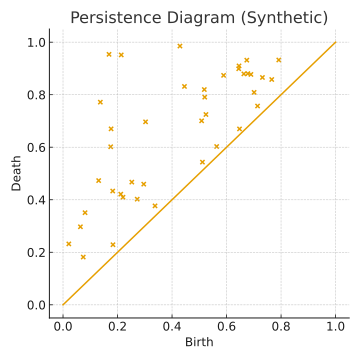

# Figure 1 — Topological Persistence Diagram

{ width="100%" loading="lazy" }

**Alt-text:** See [detailed description](../figs/alt/fig01_persistence_alt.md).  
**Source:** Generated via CI from Mermaid/Graphviz/Python.

!!! note "Rendering"
    Figures are generated during CI/CD using the documentation build pipeline.  
    When local development runs, placeholders will appear instead.
