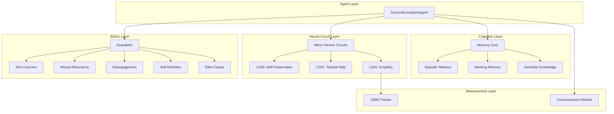

# Concord Framework Architecture

## System Overview

The Concord of Coexistence framework provides a layered architecture for ethical multi-agent systems:

## Component Interactions

For detailed information on each component:

- [Neural Circuits](circuits.md)
- [Ethics Guardians](ethics.md)
- [Empathy & CMNI](empathy.md)
- [Elliot Clause](elliot_clause.md)

## Data Flow

1. **Input**: External command or interaction context
2. **Circuit Evaluation**: L2N0 (self-preservation) runs first
3. **Ethics Check**: Non-Coercion Guardian evaluates autonomy
4. **Empathy Processing**: L2N1 activates if other agents present
5. **Decision Synthesis**: All signals integrated
6. **Memory Recording**: Episodic trace stored
7. **Output**: Action decision + compliance report

## See Also

- [Integration Guide](integration.md)
- [Observability](observability.md)
