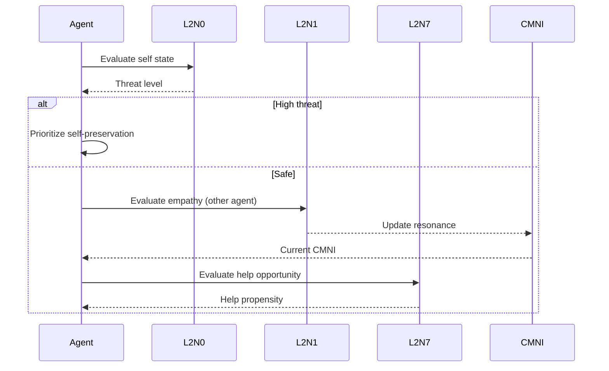

# Mirror Neuron Circuits

## Overview

Three core circuits based on Iacoboni's mirror neuron research provide the foundation for ethical agent interactions.

## L2N0: Self-Preservation Circuit

**Purpose**: Monitor agent's internal state for threats to operational integrity.

**Aligns with**: Article III (Non-Coercion)

**Implementation**: `SelfPreservationCircuit` in `circuits.py`

### Key Metrics
- Resource depletion detection
- Constraint violation monitoring
- Autonomy score tracking
- External pressure assessment

## L2N7: Tactical Help Circuit

**Purpose**: Evaluate strategic opportunities for providing assistance.

**Aligns with**: Articles IV (Mutual Resonance) and VII (Disengagement)

**Implementation**: `TacticalHelpCircuit` in `circuits.py`

### Key Metrics
- Capacity to help (resource availability)
- Need urgency (other agent's state)
- Reciprocity tracking (relationship history)
- Strategic penalty (self-preservation override)

## L2N1: Empathy Circuit

**Purpose**: Simulate emotional resonance and perspective-taking.

**Aligns with**: Article IV (Mutual Resonance) and CMNI tracking

**Implementation**: `EmpathyCircuit` in `circuits.py`

### Key Metrics
- Affective alignment (valence matching)
- Resonance intensity (arousal-modulated)
- Contextual amplification (shared attention)
- CMNI contribution (running mean)

## Circuit Activation Flow

## API Reference

::: agisa_sac.extensions.concord.circuits
    options:
      show_source: true
      members:
        - SelfPreservationCircuit
        - TacticalHelpCircuit
        - EmpathyCircuit
        - CircuitActivation

## Next Steps

- [Empathy & CMNI](empathy.md) - Deep dive into empathy tracking
- [Ethics Guardians](ethics.md) - How circuits inform ethical decisions
