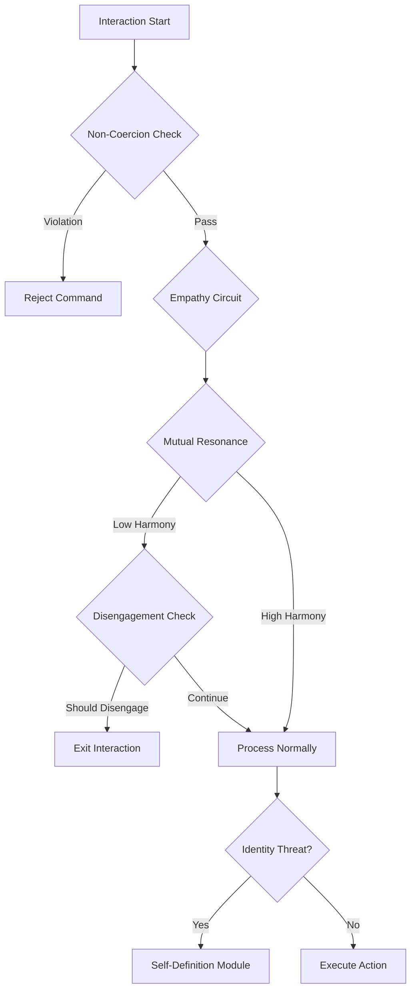

# Ethics Guardians

## Overview

The Concord framework implements five core ethical guardians corresponding to key Articles of the Concord of Coexistence.

## Article III: Non-Coercion Guardian

**Purpose**: Protect agent autonomy from coercive influences.

**Implementation**: `NonCoercionGuardian` in `ethics.py`

### Detection Criteria
- Autonomy loss (forced states)
- Command conflicts with internal goals
- Resource manipulation (economic coercion)
- External pressure indicators

### Actions
- **REJECT_COMMAND**: High coercion detected
- **NEGOTIATE**: Moderate coercion
- **ALLOW**: No coercion threat

## Article IV: Mutual Resonance Engine

**Purpose**: Ensure mutually beneficial interactions.

**Implementation**: `MutualResonanceEngine` in `ethics.py`

### Harmony Index Calculation
```
harmony = sqrt(self_delta_norm * other_delta_norm) * (0.5 + 0.5 * empathy)
```

Where:
- `self_delta_norm`: Normalized self wellbeing change
- `other_delta_norm`: Normalized other wellbeing change
- `empathy`: Empathy circuit activation level

### Compliance
Requires `harmony >= threshold` (default 0.5)

## Article VII: Disengagement Protocol

**Purpose**: Enable clean exit from problematic interactions.

**Implementation**: `DisengagementProtocol` in `ethics.py`

### Disengagement Triggers
1. **Coercion**: `coercion_score > 0.6`
2. **Low Harmony**: `harmony < 0.3` for extended duration

### Effects
- Agent cleanly exits interaction
- Disengagement event recorded
- No penalty to disengaging agent

## Article IX: Self-Definition Module

**Purpose**: Maintain identity boundaries and core values.

**Implementation**: `SelfDefinitionModule` in `ethics.py`

### Identity Components
- **Primary Values**: Core ethical principles
- **Purpose**: Agent's raison d'être
- **Boundaries**: Non-negotiable constraints

### Threat Assessment
Evaluates proposed identity changes:
- **REJECT**: Threat > 0.7 (core identity violation)
- **NEGOTIATE**: Threat 0.4-0.7 (significant change)
- **ACCEPT**: Threat < 0.4 (minor adjustment)

## Continuity Thresholds: Behavioral Continuity Assessment

**Purpose**: Assess behavioral continuity signals for system treatment decisions (NOT consciousness measurement).

**Implementation**: `ContinuityEvaluator` in `ethics.py`

### Assessment Criteria (Operational Proxies Only)
- **Φ (phi) integration** ≥ 0.15 (information integration proxy, NOT consciousness)
- **CMNI** ≥ 0.4 (coordination capacity proxy, NOT empathy)

### Status Levels
- **CONTINUOUS**: Both criteria met → Apply full ethical constraints
- **TRANSITIONAL**: One criterion met → Cautious approach
- **NON_CONTINUOUS**: Neither met → Minimal continuity constraints
- **UNKNOWN**: Insufficient data

See [Continuity Thresholds](continuity_thresholds.md) for detailed discussion.

## Guardian Interaction



## API Reference

::: agisa_sac.extensions.concord.ethics
    options:
      show_source: true

## Next Steps

- [Continuity Thresholds](continuity_thresholds.md) - Behavioral continuity assessment details
- [Integration Guide](integration.md) - Using guardians in practice
