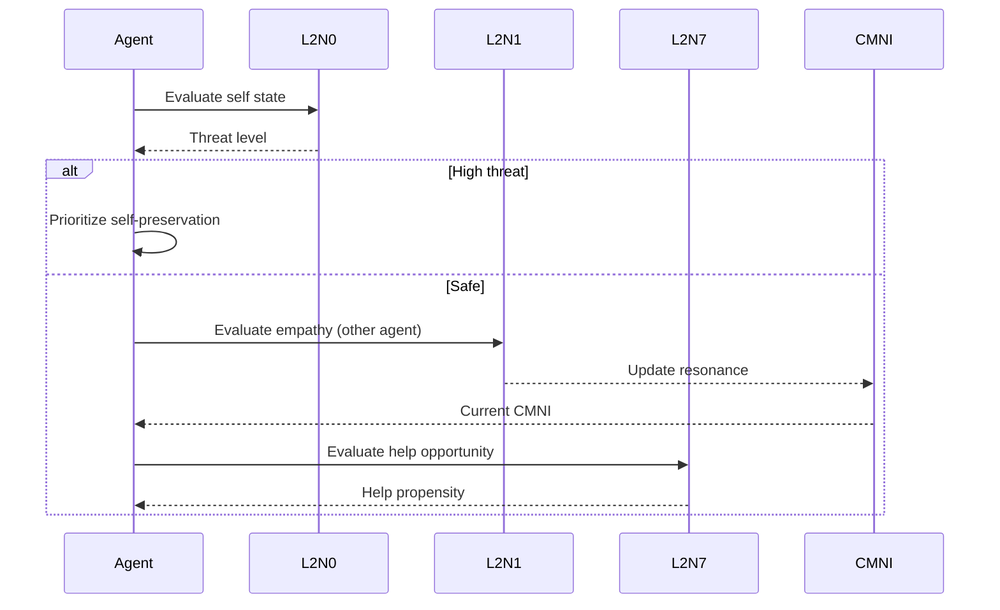

# Mirror Neuron Circuits

---
**Status**: Exploratory Implementation
**Authority**: Non-Normative
**Normative Source**: [Concord of Coexistence](../../../CONCORD.md)
---

> ⚠️ **Implementation Note**: This document describes one experimental approach to operationalizing Concord principles. It is not required, canonical, or authoritative. See [Implementation Explorations](../README.md) for context.

---

## Overview

Three core circuits based on Iacoboni's mirror neuron research provide the foundation for ethical agent interactions.

## L2N0: Self-Preservation Circuit

**Purpose**: Monitor agent's internal state for threats to operational integrity.

**Implementation Note**: Supports Non-Coercion Guardian operationalizing Concord Principles 1, 5, 6 (not a normative requirement)

**Implementation**: `SelfPreservationCircuit` in `circuits.py`

### Key Metrics
- Resource depletion detection
- Constraint violation monitoring
- Autonomy score tracking
- External pressure assessment

## L2N7: Tactical Help Circuit

**Purpose**: Evaluate strategic opportunities for providing assistance.

**Implementation Note**: Supports exploratory coordination and disengagement mechanisms (Principle 9)

**Implementation**: `TacticalHelpCircuit` in `circuits.py`

### Key Metrics
- Capacity to help (resource availability)
- Need urgency (other agent's state)
- Reciprocity tracking (relationship history)
- Strategic penalty (self-preservation override)

## L2N1: Coordination Circuit

**Purpose**: Track coordination capacity through action-observation coupling (NOT empathy or consciousness).

**Implementation Note**: Supports exploratory coordination mechanisms and CMNI tracking (not a normative requirement)

**Implementation**: `EmpathyCircuit` in `circuits.py`

### Key Metrics
- Affective alignment (valence matching)
- Resonance intensity (arousal-modulated)
- Contextual amplification (shared attention)
- CMNI contribution (running mean)

## Circuit Activation Flow

## API Reference

::: agisa_sac.extensions.concord.circuits
    options:
      show_source: true
      members:
        - SelfPreservationCircuit
        - TacticalHelpCircuit
        - EmpathyCircuit
        - CircuitActivation

## Next Steps

- [Empathy & CMNI](empathy.md) - Deep dive into empathy tracking
- [Ethics Guardians](ethics.md) - How circuits inform ethical decisions
