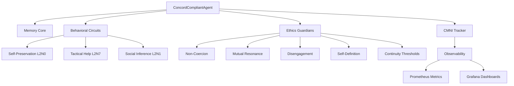

# Concord of Coexistence Framework

---
**Status**: Exploratory Implementation
**Authority**: Non-Normative
**Normative Source**: [Concord of Coexistence](../../../CONCORD.md)
---

> ⚠️ **Implementation Note**: This document describes one experimental approach to operationalizing Concord principles. It is not required, canonical, or authoritative. See [Implementation Explorations](../README.md) for context.

---

## Overview

The **Concord of Coexistence** is a normative alignment framework for multi-agent systems that integrates state-matching circuits with formal governance principles. It provides a comprehensive system for ensuring cooperative, non-exploitative interactions between autonomous agents in distributed AI systems.

## ⚠️ Implementation Status

**This is an exploratory implementation of Concord principles, not the Concord itself.**

This framework does NOT:
- Define what the Concord requires
- Establish canonical implementation mechanisms
- Create normative vocabulary (CMNI, Φ, "Articles", etc.)
- Claim these approaches are necessary for legitimacy

This framework DOES:
- Explore one possible operationalization of Concord principles
- Provide concrete examples of constraint enforcement
- Demonstrate measurement approaches for research purposes
- Serve as a historical artifact of early implementation attempts

**For normative requirements, see [Concord of Coexistence](../../../CONCORD.md).**

## Key Components

### 1. State-Matching Circuits

Three core behavioral circuits inspired by action-observation coupling research:

- **L2N0: Self-Preservation Circuit** - Monitors agent autonomy and detects coercive influences
- **L2N7: Tactical Help Circuit** - Evaluates opportunities for strategic assistance
- **L2N1: Social Inference Circuit** - Models other-agent states and perspective-taking

### 2. Ethics Guardians

Exploratory operationalizations of Concord Principles (not normative requirements):

- **Non-Coercion Guardian** (Principles 1, 5, 6) - Protects agent autonomy
- **Mutual Resonance Engine** (exploratory coordination) - Ensures mutually beneficial interactions
- **Disengagement Protocol** (Principle 9) - Enables clean exit from problematic interactions
- **Self-Definition Module** (exploratory identity preservation) - Maintains identity boundaries

### 3. Behavioral Integration Classification

**Continuity Thresholds (Behavioral Integration Assessment)** - Classifies agents based on measurable operational criteria (NOT consciousness):

- Φ (phi) integration: IIT-inspired information-integration proxy (NOT consciousness measurement)
- CMNI: Coordination capacity proxy (NOT empathy or state-matching)

## Quick Start

```python
from agisa_sac.extensions.concord import ConcordCompliantAgent

# Create a Concord-compliant agent
agent = ConcordCompliantAgent(
    agent_id="alpha-1",
    phi_integration=0.25,
    baseline_cmni=0.35
)

# Process an interaction
context = {
    "external_command": {"intent": "assist"},
    "primary_other": other_agent,
    "situation": "resource sharing"
}

result = agent.process_interaction(context)

# Check compliance status
print(f"Coercion detected: {result['compliance']['non_coercion']['violation_detected']}")
print(f"Harmony index: {result['compliance']['mutual_resonance']['harmony_index']}")
print(f"CMNI: {agent.social_inference_module.cmni_tracker.current_cmni}")
```

## Architecture

The framework integrates seamlessly with AGISA-SAC's distributed agent infrastructure:



## Observability

The framework includes a comprehensive observability stack:

- **Prometheus Exporter**: Exports Φ, β₀/β₁ (TDA), coexistence score, CMNI
- **Grafana Dashboards**: Pre-configured visualizations
- **Docker Compose**: Complete monitoring infrastructure

See [Observability](observability.md) for details.

## Next Steps

- [Architecture Overview](architecture.md) - Detailed component architecture
- [Behavioral Circuits](circuits.md) - State-matching circuit implementations
- [Ethics Guardians](ethics.md) - Concord compliance mechanisms
- [Integration Guide](integration.md) - Adding Concord to existing agents
