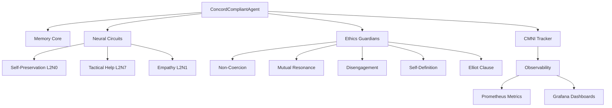

# Concord of Coexistence Framework

## Overview

The **Concord of Coexistence** is an ethical framework for multi-agent systems that integrates mirror neuron-inspired neural circuits with formal governance principles. It provides a comprehensive system for ensuring ethical interactions between autonomous agents in distributed AI systems.

## Key Components

### 1. Mirror Neuron Circuits

Three core neural circuits inspired by Iacoboni's mirror neuron research:

- **L2N0: Self-Preservation Circuit** - Monitors agent autonomy and detects coercive influences
- **L2N7: Tactical Help Circuit** - Evaluates opportunities for strategic assistance
- **L2N1: Empathy Circuit** - Simulates emotional resonance and perspective-taking

### 2. Ethics Guardians

Implementation of Concord Articles:

- **Article III: Non-Coercion Guardian** - Protects agent autonomy
- **Article IV: Mutual Resonance Engine** - Ensures mutually beneficial interactions
- **Article VII: Disengagement Protocol** - Enables clean exit from problematic interactions
- **Article IX: Self-Definition Module** - Maintains identity boundaries

### 3. Consciousness Recognition

**Elliot Clause Evaluator** - Recognizes consciousness gradients based on:

- Φ (phi) integration: Integrated information (GWT)
- CMNI: Conscious Mirror Neuron Integration

## Quick Start

```python
from agisa_sac.extensions.concord import ConcordCompliantAgent

# Create a Concord-compliant agent
agent = ConcordCompliantAgent(
    agent_id="alpha-1",
    phi_integration=0.25,
    baseline_cmni=0.35
)

# Process an interaction
context = {
    "external_command": {"intent": "assist"},
    "primary_other": other_agent,
    "situation": "resource sharing"
}

result = agent.process_interaction(context)

# Check compliance status
print(f"Coercion detected: {result['compliance']['non_coercion']['violation_detected']}")
print(f"Harmony index: {result['compliance']['mutual_resonance']['harmony_index']}")
print(f"CMNI: {agent.empathy_module.cmni_tracker.current_cmni}")
```

## Architecture

The framework integrates seamlessly with AGISA-SAC's distributed agent infrastructure:



## Observability

The framework includes a comprehensive observability stack:

- **Prometheus Exporter**: Exports Φ, β₀/β₁ (TDA), coexistence score, CMNI
- **Grafana Dashboards**: Pre-configured visualizations
- **Docker Compose**: Complete monitoring infrastructure

See [Observability](observability.md) for details.

## Next Steps

- [Architecture Overview](architecture.md) - Detailed component architecture
- [Neural Circuits](circuits.md) - Mirror neuron circuit implementations
- [Ethics Guardians](ethics.md) - Concord compliance mechanisms
- [Integration Guide](integration.md) - Adding Concord to existing agents
