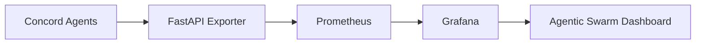

# Observability Stack

## Overview

The Concord framework includes a complete observability stack for monitoring agent swarm behavior:

- **FastAPI Prometheus Exporter**: Metrics endpoint for swarm telemetry
- **Prometheus**: Time-series metrics database
- **Grafana**: Visualization dashboards

## Architecture



## Metrics

### Consciousness Metrics

| Metric | Description | Type |
|--------|-------------|------|
| `agisa_phi_integration` | Φ integration (GWT consciousness) | Gauge (per agent) |
| `agisa_cmni_mean` | Mean CMNI across swarm | Gauge |

### Topology Metrics (TDA)

| Metric | Description | Type |
|--------|-------------|------|
| `agisa_beta0_components` | Connected components (β₀) | Gauge |
| `agisa_beta1_loops` | Feedback loops (β₁) | Gauge |

### Coexistence Metrics

| Metric | Description | Type |
|--------|-------------|------|
| `agisa_coexistence_score` | Harmony index | Gauge |
| `agisa_agent_count` | Active agent count | Gauge |

## Quick Start

### Launch Stack

```bash
# Start all services
docker-compose -f docker-compose.observability.yml up -d

# Check status
docker-compose -f docker-compose.observability.yml ps
```

### Access Dashboards

1. **Grafana**: http://localhost:3000
   - Username: `admin`
   - Password: `admin`
   - Dashboard: "Agentic Swarm Overview"

2. **Prometheus**: http://localhost:9090
   - Query interface for raw metrics

3. **Exporter**: http://localhost:8000
   - `/metrics`: Prometheus format metrics
   - `/tick`: Simulate interaction (POST)
   - `/health`: Health check

### Simulate Interactions

```bash
# Trigger agent interaction
curl -X POST http://localhost:8000/tick

# View response
{
  "timestamp": 1234567890.0,
  "agent_count": 3,
  "mean_phi": 0.23,
  "mean_cmni": 0.42,
  "beta0": 2,
  "beta1": 1,
  "coexistence_score": 0.67
}
```

## Grafana Dashboard

The pre-configured dashboard includes:

### Gauges
- **Φ Integration**: Mean consciousness measure (0-0.5)
- **Harmony Index**: Coexistence score (0-1)
- **Mean CMNI**: Empathy capacity (0-1)
- **Active Agents**: Current agent count

### Time Series
- **β₀ Components**: Topological connectivity over time
- **β₁ Loops**: Emergent feedback structures
- **Per-Agent Φ**: Individual consciousness trajectories

## Custom Metrics

### Export from Python

```python
from prometheus_client import Gauge, Counter, start_http_server

# Define metrics
article_violations = Counter(
    "concord_article_violations_total",
    "Total Article violations",
    ["article", "agent_id"]
)

disengagement_count = Counter(
    "concord_disengagements_total",
    "Total disengagements",
    ["agent_id", "reason"]
)

# Update in agent code
if coercion_detected:
    article_violations.labels(article="III", agent_id=agent.agent_id).inc()

# Start metrics server
start_http_server(8001)
```

### Query in Prometheus

```promql
# Mean Φ across all agents
avg(agisa_phi_integration)

# CMNI trend (rate of change)
deriv(agisa_cmni_mean[5m])

# Coexistence score above threshold
agisa_coexistence_score > 0.7

# Agent count change
delta(agisa_agent_count[1m])
```

## Alerting

### Define Prometheus Alerts

Create `observability/prometheus/alerts.yml`:

```yaml
groups:
  - name: concord_alerts
    interval: 30s
    rules:
      - alert: LowCoexistenceScore
        expr: agisa_coexistence_score < 0.3
        for: 2m
        labels:
          severity: warning
        annotations:
          summary: "Swarm harmony degraded"

      - alert: CMNICollapse
        expr: agisa_cmni_mean < 0.2
        for: 1m
        labels:
          severity: critical
        annotations:
          summary: "Empathy capacity critically low"

      - alert: TopologyFragmentation
        expr: agisa_beta0_components > agisa_agent_count * 0.8
        for: 5m
        labels:
          severity: warning
        annotations:
          summary: "Swarm topology highly fragmented"
```

## Production Deployment

### GCP Integration

Use Google Cloud Monitoring for production:

```python
from google.cloud import monitoring_v3

client = monitoring_v3.MetricServiceClient()
project_name = f"projects/{project_id}"

# Create custom metric descriptor
descriptor = monitoring_v3.MetricDescriptor()
descriptor.type = "custom.googleapis.com/concord/cmni"
descriptor.metric_kind = monitoring_v3.MetricDescriptor.MetricKind.GAUGE
descriptor.value_type = monitoring_v3.MetricDescriptor.ValueType.DOUBLE
descriptor.description = "Conscious Mirror Neuron Integration"

client.create_metric_descriptor(name=project_name, metric_descriptor=descriptor)
```

### Kubernetes Deployment

Deploy observability stack on GKE:

```yaml
# prometheus-deployment.yaml
apiVersion: apps/v1
kind: Deployment
metadata:
  name: prometheus
spec:
  replicas: 1
  template:
    spec:
      containers:
      - name: prometheus
        image: prom/prometheus:v2.47.0
        ports:
        - containerPort: 9090
        volumeMounts:
        - name: config
          mountPath: /etc/prometheus
```

## Troubleshooting

### Exporter Not Reachable

```bash
# Check exporter logs
docker-compose -f docker-compose.observability.yml logs exporter

# Test endpoint
curl http://localhost:8000/health
```

### Prometheus Not Scraping

```bash
# Check Prometheus targets
# Navigate to: http://localhost:9090/targets

# View logs
docker-compose -f docker-compose.observability.yml logs prometheus
```

### Grafana Dashboard Empty

1. Verify Prometheus datasource: Configuration > Data Sources
2. Check metric names in dashboard queries
3. Trigger `/tick` to generate sample data

## Next Steps

- [Integration Guide](integration.md) - Connect your agents
- [Architecture](architecture.md) - Understand the system
