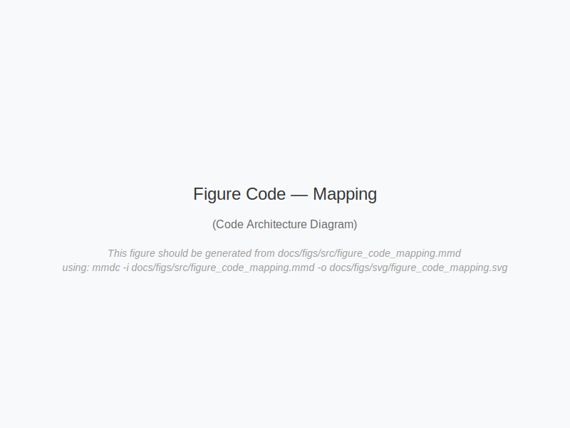

# Figure Code — Code ↔ Consciousness Class Diagram



**Alt-text**: See [figs/alt/fig_code_mapping_alt.md](../figs/alt/fig_code_mapping_alt.md).

**Source**: Rendered via CI from Mermaid source `docs/figs/src/figure_code_mapping.mmd`.

## Overview

A UML class diagram providing bidirectional traceability between consciousness theory and implementation:

**Five Core Classes**:
1. **planner_function**: Predictive Processing, Active Inference → `agents/planner.py`
2. **evaluator_function**: Metacognition, Error Monitoring → `agents/evaluator.py`
3. **PubSub**: Global Workspace Theory → `gcp/pubsub.py`
4. **Firestore**: Autobiographical Memory → `core/memory.py`
5. **CloudTasks**: Attention Mechanisms → `gcp/tasks.py`

Each class includes:
- Methods (computational implementation)
- Theory annotations (consciousness frameworks)
- Code paths (actual source files)

## Rendering

```bash
mmdc -i docs/figs/src/figure_code_mapping.mmd \
     -o docs/figs/svg/figure_code_mapping.svg \
     -w 2400 -H 1800 -b transparent
```

## Whitepaper Reference

This validates the paper's claim that consciousness theories can guide software architecture:
- Section 2.1: Global Workspace Theory implementation
- Section 3.1: Persistent Identity via Firestore
- Section 3.2: Reflexivity through evaluator-planner relationship

## Key Insight

This diagram serves as a **Rosetta Stone** between whitepaper and codebase - every theory annotation is a testable hypothesis, and every method is a measurement point. This enables empirical validation of consciousness theories through software.

## Traceability Matrix

| Theory Concept | Code Element | File Path |
|----------------|--------------|-----------|
| Predictive Processing | `generate_action_plan()` | `agents/planner.py` |
| Metacognition | `score_performance()` | `agents/evaluator.py` |
| Global Workspace | `broadcast()` | `gcp/pubsub.py` |
| Autobiographical Memory | `write_episode()` | `core/memory.py` |
| Attention | `prioritize()` | `gcp/tasks.py` |
